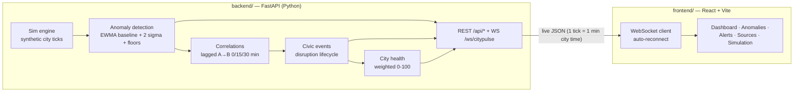

# 🌆 CityPulse — Live Civic Intelligence & Event Detection System

A full-stack civic-data fusion platform for a fictional city (Zone A / Zone B / Zone C).
A live Python simulation streams weather, traffic, complaint, and incident telemetry
through an analytics pipeline (anomaly detection → lagged correlations → multi-signal
civic-event detection → disruption lifecycle → city health) to a **React + Vite +
Leaflet + Recharts** dashboard over **REST + WebSocket**. No Streamlit.

> **Honesty first:** correlations are shown as *possible links*, never causes. Event
> Confidence and the health score are **prototype indicators** (not probabilities or
> official metrics). All data is synthetic for a fictional city.

### 🔗 Live demo

**https://lanes-terminals-campbell-ace.trycloudflare.com**

One public URL serving the built React dashboard *and* the FastAPI REST/WebSocket API
(single-origin, so no CORS and no second host). Started with the
[Instant public URL](#instant-public-url--no-cloud-account-needed) flow below.
Quick-tunnel URLs are **ephemeral** — this link dies when the tunnel process or the
machine stops, so treat it as a snapshot of the running app rather than a permanent
link. For a stable address use the Render + Vercel path.

## Architecture



```
CityPulse/
├── backend/
│   ├── main.py            # Sim engine + analytics + FastAPI REST/WebSocket
│   └── requirements.txt   # fastapi, uvicorn, numpy, pydantic
├── frontend/
│   ├── src/App.jsx        # Live dashboard (map, KPIs, why-now, links, events)
│   ├── src/main.jsx       # React entry
│   ├── src/index.css      # Civic command-center theme
│   ├── index.html
│   ├── vite.config.js
│   └── package.json
├── legacy_streamlit/      # v2.0 Streamlit version, kept for reference
├── .env.example           # VITE_API_URL / VITE_WS_URL template
├── .gitignore
└── README.md
```

## Run

**Backend** (terminal 1):
```bash
cd backend
python -m venv .venv
.venv\Scripts\activate          # Windows (source .venv/bin/activate on macOS/Linux)
pip install -r requirements.txt
uvicorn main:app --reload
# → http://127.0.0.1:8000  (Swagger docs at /docs)
```

**Frontend** (terminal 2):
```bash
cd frontend
npm install
npm run dev
# → http://localhost:5173
```

Dev proxying is preconfigured: `vite.config.js` forwards `/api` and the `/ws`
WebSocket to `http://127.0.0.1:8000` (override with the `BACKEND_URL` env var),
so no frontend `.env` is needed for local development. If the backend runs
elsewhere — or for a single-origin production build — copy `.env.example` to
`frontend/.env` and set `VITE_API_URL` / `VITE_WS_URL` instead.

## Live city map

The dashboard map is a Google-Maps-style Leaflet view over the backend zone
registry (stable synthetic coordinates, never randomised per render):

- **Five free basemaps** — Light (Esri Light Gray Canvas, the clean white
  Google-Maps-like default), Streets (OSM), Satellite (Esri imagery + place
  labels), Terrain (OpenTopoMap) and Night (Esri Dark Gray Canvas). All are
  key-less; CARTO tiles were dropped entirely because both dark and light
  styles now require an API key and render "API KEY REQUIRED" watermarks.
- **Zone search** with results dropdown — Enter or click flies to the zone and
  opens its place card (health chips, live metric readings, zoom button).
- **Layer toggles** for zones / anomaly dots / civic-event footprints; the
  cursor readout shows live coordinates + zoom; a legend explains every colour
  (severity never communicated by colour alone).
- **Locate me** (browser geolocation), **fit-all-markers**, zoom stack and
  true fullscreen, with `invalidateSize` handling for grid/resize changes.
- Event footprints show state + confidence tooltips and link straight into the
  event evidence drawer; invalid/missing coordinates are skipped and counted.

## The 60–90 second demo

1. Open **Simulation** → press **Run full civic disruption** (5x; about 80 seconds).
2. Watch the **Dashboard**: City Health falls from ~90 (HEALTHY) as Zone A's rainfall
   rises; anomaly dots appear on the map.
3. Traffic congestion, complaints, and road incidents follow with a visible ~15-minute
   lag; the **CIVIC EVENT** panel appears with **CityPulse Event Confidence** and the
   state machine DETECTED → MONITORING → ESCALATING → PEAK.
4. **Why now?** lists evidence: "Rainfall is 24.1× baseline (23.4 vs 0.97 mm)… Rainfall
   changes preceded traffic changes by approximately 15 minutes (r ≈ 0.9 — possible
   temporal association, not a confirmed cause)."
5. **Alerts** accumulate WATCH → WARNING → CRITICAL; acknowledge/resolve them.
6. Past minute ~400 the storm tapers: the disruption transitions RECOVERING → RESOLVED
   and City Health returns to HEALTHY.

## API

```
GET  /api/health                     GET  /api/dashboard
GET  /api/events?zone=&source=&severity=&limit=
GET  /api/anomalies?status=&zone=    GET  /api/correlations
GET  /api/disruptions                GET  /api/alerts
POST /api/alerts/{id}/{acknowledge|resolve}
GET  /api/sources                    GET  /api/zones
GET  /api/metrics                    GET  /api/trends?minutes=
GET  /api/summary
GET  /api/simulation/status
POST /api/simulation/{start,pause,step,reset,restart,scenario,speed,demo,source}
WS   /ws/citypulse   (event_created, anomaly_detected, correlation_detected,
                      disruption_created/updated, alert_created, score_updated, …)
```

Simulation controls: scenarios `normal | heavy_rain | urban_flooding | traffic_incident |
full_disruption`; speeds `0.5–10x`; per-source outage simulation (a feed going offline
resolves its anomalies and the rest keep running).

## ML / analytics explanation (judge-ready)

- **Anomaly detection** — per (zone, metric) EWMA baseline mean/variance that learns
  *only from non-anomalous readings*. A value is anomalous when it exceeds
  baseline + 2σ **and** a practical significance floor (3 mm rain, +25-point congestion
  shift, ≥4 complaints/15 min). Needs ≥2 consecutive abnormal ticks (persistence).
  Future upgrade: Isolation Forest for multivariate anomalies.
- **Correlations** — Pearson r per zone for A(t) → B(t+lag), lag ∈ {0, 15, 30 min},
  classified Strong/Moderate/Weak × positive/inverse. Wording is direction-aware:
  inverse relationships are never described as "moving together"; lagged positives are
  described as *possible temporal association*, never causation.
- **Civic events** — ≥2 co-active anomaly signals in one zone fuse into an event with a
  lifecycle (DETECTED → MONITORING → ESCALATING → PEAK → RECOVERING → RESOLVED) and
  **CityPulse Event Confidence** — an explainable prototype score from signal strength
  (mean |z|), diversity (signal count), temporal proximity, and persistence. Not a
  probability.
- **City health** — Traffic 40% / Weather 30% / Complaints 30% weighted components
  (0–100 each, higher = healthier), minus penalties for active anomalies/disruptions.
  Bands: HEALTHY ≥85, STABLE ≥70, DEGRADED ≥50, CRITICAL <50.
- **Prediction** — least-squares trend over the last 30 minutes, extrapolated +30 min,
  shown as a range with trend strength. Prototype estimate, not a forecast.

## Deploy

The repo ships deploy-ready: `backend/Dockerfile` + `render.yaml` (Render) and
`frontend/vercel.json` (Vercel, SPA rewrites). `frontend/.env.example` documents both
local and production API/WS URLs.

**Backend → Render (Docker, free tier works):**
1. Push this folder to GitHub.
2. Render → New → Blueprint → select the repo (`render.yaml` creates
   `citypulse-backend` from `backend/Dockerfile`, health check `/api/health`).
3. Note the public URL, e.g. `https://citypulse-backend.onrender.com`.

**Frontend → Vercel:**
1. Vercel → New Project → select the repo, root directory `frontend`.
2. Environment variables:
   - `VITE_API_URL=https://citypulse-backend.onrender.com`
   - `VITE_WS_URL=wss://citypulse-backend.onrender.com/ws/citypulse`
3. Deploy. `vercel.json` handles SPA routing + `npm run build` output (`dist`).

**After deploy:** set Render env `CITYPULSE_ALLOWED_ORIGINS=https://<your-app>.vercel.app`
(no `*` in production) and redeploy the backend. Verify:
`GET https://<backend>/api/health → {"status":"ok"}` and the Vercel app loads the
dashboard with a LIVE badge. Note: Render free tier sleeps when idle — first load
wakes it (~30–60 s); the frontend keeps usable REST fallback + reconnect meanwhile.

### Instant public URL — no cloud account needed

`backend/main.py` also serves the built React app (`frontend/dist`) from the same
FastAPI process, so **one** public URL runs the whole project with REST + WebSocket
on the same origin (no CORS, no second frontend host). This is the fastest way to
share a running demo:

```bash
# 1. Build the frontend. Same-origin requires no frontend/.env — leave
#    VITE_API_URL/VITE_WS_URL unset so every call stays relative.
cd frontend && npm run build

# 2. Run the backend so one process serves dist/ + the API/WebSocket
cd ../backend && .venv\Scripts\python.exe -m uvicorn main:app --host 127.0.0.1 --port 8000

# 3. Publish that port with a Cloudflare quick tunnel (free, key-less)
cloudflared tunnel --url http://127.0.0.1:8000 --no-autoupdate
# → https://<random-words>.trycloudflare.com
```

Current deployment (this run): `https://lanes-terminals-campbell-ace.trycloudflare.com`.

Cloudflare passes WebSockets through, so the LIVE badge and streaming work
unchanged (`lib/api.js` derives `wss://<tunnel-host>/ws/citypulse` from the page URL
when `VITE_API_URL` is unset). Verify with `GET https://<tunnel-host>/api/health →
{"status":"ok"}`, then start the sim from the UI or `POST /api/simulation/start` so
the shared dashboard shows live data. Quick-tunnel URLs are **ephemeral** — they
change on every restart and die with the tunnel process or the host machine; use the
Render + Vercel path above when you need a stable URL.

## Limitations

Synthetic data for a fictional city · prototype confidence/health indicators · 3 zones ·
simple linear prediction · Pearson-only correlations (no nonlinear or causal inference) ·
no real government APIs · in-memory state (a backend restart clears the run; use
reset/demo endpoints) · frontend demo login only (localStorage, no server auth).
