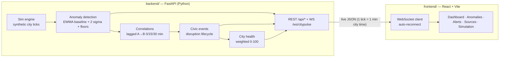

# 🌆 CityPulse — Live Civic Intelligence & Event Detection System

A full-stack civic-data fusion platform for a fictional city (Zone A / Zone B / Zone C).
A live Python simulation streams weather, traffic, complaint, and incident telemetry
through an analytics pipeline (anomaly detection → lagged correlations → multi-signal
civic-event detection → disruption lifecycle → city health) to a **React + Vite +
Leaflet + Recharts** dashboard over **REST + WebSocket**. No Streamlit.

> **Honesty first:** correlations are shown as *possible links*, never causes. Event
> Confidence and the health score are **prototype indicators** (not probabilities or
> official metrics). All data is synthetic for a fictional city.

## Architecture



```
CityPulse/
├── backend/
│   ├── main.py            # Sim engine + analytics + FastAPI REST/WebSocket
│   └── requirements.txt   # fastapi, uvicorn, numpy, pydantic
├── frontend/
│   ├── src/App.jsx        # Live dashboard (map, KPIs, why-now, links, events)
│   ├── src/main.jsx       # React entry
│   ├── src/index.css      # Civic command-center theme
│   ├── index.html
│   ├── vite.config.js
│   └── package.json
├── legacy_streamlit/      # v2.0 Streamlit version, kept for reference
├── .env.example           # VITE_API_URL / VITE_WS_URL template
├── .gitignore
└── README.md
```

## Run

**Backend** (terminal 1):
```bash
cd backend
python -m venv .venv
.venv\Scripts\activate          # Windows (source .venv/bin/activate on macOS/Linux)
pip install -r requirements.txt
uvicorn main:app --reload
# → http://127.0.0.1:8000  (Swagger docs at /docs)
```

**Frontend** (terminal 2):
```bash
cd frontend
npm install
npm run dev
# → http://localhost:5173
```

If the backend runs elsewhere, copy `.env.example` to `frontend/.env` and set
`VITE_API_URL` / `VITE_WS_URL`.

## The 60–90 second demo

1. Open **Simulation** → press **Run full civic disruption** (5x; about 80 seconds).
2. Watch the **Dashboard**: City Health falls from ~90 (HEALTHY) as Zone A's rainfall
   rises; anomaly dots appear on the map.
3. Traffic congestion, complaints, and road incidents follow with a visible ~15-minute
   lag; the **CIVIC EVENT** panel appears with **CityPulse Event Confidence** and the
   state machine DETECTED → MONITORING → ESCALATING → PEAK.
4. **Why now?** lists evidence: "Rainfall is 24.1× baseline (23.4 vs 0.97 mm)… Rainfall
   changes preceded traffic changes by approximately 15 minutes (r ≈ 0.9 — possible
   temporal association, not a confirmed cause)."
5. **Alerts** accumulate WATCH → WARNING → CRITICAL; acknowledge/resolve them.
6. Past minute ~400 the storm tapers: the disruption transitions RECOVERING → RESOLVED
   and City Health returns to HEALTHY.

## API

```
GET  /api/health                     GET  /api/dashboard
GET  /api/events?zone=&source=&severity=&limit=
GET  /api/anomalies?status=&zone=    GET  /api/correlations
GET  /api/disruptions                GET  /api/alerts
POST /api/alerts/{id}/{acknowledge|resolve}
GET  /api/sources                    GET  /api/zones
GET  /api/metrics                    GET  /api/trends?minutes=
GET  /api/summary
GET  /api/simulation/status
POST /api/simulation/{start,pause,step,reset,restart,scenario,speed,demo,source}
WS   /ws/citypulse   (event_created, anomaly_detected, correlation_detected,
                      disruption_created/updated, alert_created, score_updated, …)
```

Simulation controls: scenarios `normal | heavy_rain | urban_flooding | traffic_incident |
full_disruption`; speeds `0.5–10x`; per-source outage simulation (a feed going offline
resolves its anomalies and the rest keep running).

## ML / analytics explanation (judge-ready)

- **Anomaly detection** — per (zone, metric) EWMA baseline mean/variance that learns
  *only from non-anomalous readings*. A value is anomalous when it exceeds
  baseline + 2σ **and** a practical significance floor (3 mm rain, +25-point congestion
  shift, ≥4 complaints/15 min). Needs ≥2 consecutive abnormal ticks (persistence).
  Future upgrade: Isolation Forest for multivariate anomalies.
- **Correlations** — Pearson r per zone for A(t) → B(t+lag), lag ∈ {0, 15, 30 min},
  classified Strong/Moderate/Weak × positive/inverse. Wording is direction-aware:
  inverse relationships are never described as "moving together"; lagged positives are
  described as *possible temporal association*, never causation.
- **Civic events** — ≥2 co-active anomaly signals in one zone fuse into an event with a
  lifecycle (DETECTED → MONITORING → ESCALATING → PEAK → RECOVERING → RESOLVED) and
  **CityPulse Event Confidence** — an explainable prototype score from signal strength
  (mean |z|), diversity (signal count), temporal proximity, and persistence. Not a
  probability.
- **City health** — Traffic 40% / Weather 30% / Complaints 30% weighted components
  (0–100 each, higher = healthier), minus penalties for active anomalies/disruptions.
  Bands: HEALTHY ≥85, STABLE ≥70, DEGRADED ≥50, CRITICAL <50.
- **Prediction** — least-squares trend over the last 30 minutes, extrapolated +30 min,
  shown as a range with trend strength. Prototype estimate, not a forecast.

## Limitations

Synthetic data for a fictional city · prototype confidence/health indicators · 3 zones ·
simple linear prediction · Pearson-only correlations (no nonlinear or causal inference) ·
no real government APIs · no authentication/production deployment · single-process
in-memory state.
